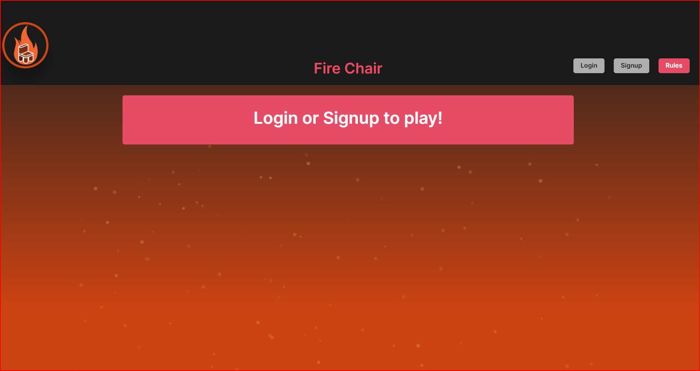
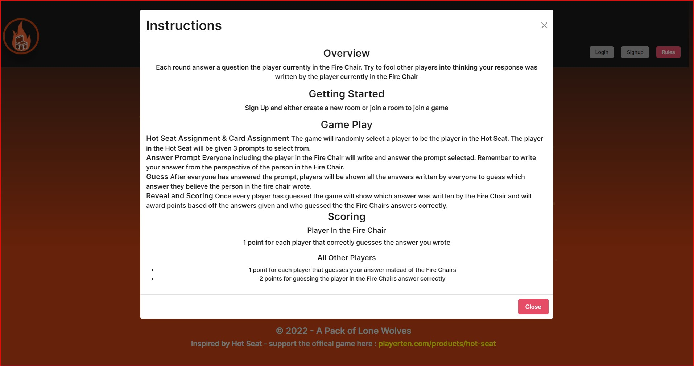

# Fire Chair

## Overview

We created Fire Chair as a way to play a favorite table top game "Hot Seat". This  is a multiplayer game where users can guess which answer was provided by the user in the Fire Chair.

## Key Technology Used

The following items were used in making our full stack application:

* React

* Socket.IO

* JavaScript

* Express

* MongoDB

* GraphQL

* Node.JS

* Mongoose

## Screenshots

## Contributions

Billy: Created the socket.io link between client and server and setup the logic of the game.

Ezequiel: GraphQL, Profile page and Mongoose.

Dre: Styling, homepage design and live animations.

Cole: Sketched layout of the app, designed game lobby and navbar and ReadMe

Thiago: Profile and Game style, Project manager with good times and moral support.

## License

Copyright 2022 A-Pack-Of-Lone-Wolves

Permission is hereby granted, free of charge, to any person obtaining a copy of this software and associated documentation files (the "Software"), to deal in the Software without restriction, including without limitation the rights to use, copy, modify, merge, publish, distribute, sublicense, and/or sell copies of the Software, and to permit persons to whom the Software is furnished to do so, subject to the following conditions:

The above copyright notice and this permission notice shall be included in all copies or substantial portions of the Software.

THE SOFTWARE IS PROVIDED "AS IS", WITHOUT WARRANTY OF ANY KIND, EXPRESS OR IMPLIED, INCLUDING BUT NOT LIMITED TO THE WARRANTIES OF MERCHANTABILITY, FITNESS FOR A PARTICULAR PURPOSE AND NONINFRINGEMENT. IN NO EVENT SHALL THE AUTHORS OR COPYRIGHT HOLDERS BE LIABLE FOR ANY CLAIM, DAMAGES OR OTHER LIABILITY, WHETHER IN AN ACTION OF CONTRACT, TORT OR OTHERWISE, ARISING FROM, OUT OF OR IN CONNECTION WITH THE SOFTWARE OR THE USE OR OTHER DEALINGS IN THE SOFTWARE.

## Contact

Dondre Mclenan -(https://github.com/dmclenan)

Ezequiel Mejias Melo - (https://github.com/EzequielMejiasMelo)

Billy Ruback - (https://github.com/WRuback)

Thiago Rodrigues - (https://github.com/ThiagoRodrigues3)

Cole Webster - (https://github.com/ColeWebster)
